# Avatar Lecture

**완성된 강의 mp4 의 확정 자원을 그대로 가져와, 아바타가 강의하는 영상으로
다시 세웁니다.**

새로 쓰는 것이 없습니다 — 대본·번역 자막·슬라이드·목소리는 이미 만들어 검수까지
마친 것입니다. 이 저장소는 그것들을 씬으로 갈라 **아바타만 갈아 끼웁니다.**

**목소리도 새로 만들지 않습니다.** 원본 mp4 에서 그 씬 구간의 소리를 그대로 떼어
옵니다 — **이 앱에서는 우즈베크어 음성을 만들 수 없습니다**
([붙일 수 있는 TTS 가 다루는 언어](#이-앱에서-목소리를-만들-수-있는-언어)에
우즈베크어가 없습니다). 이미 우즈베크어로 녹음된 소리를 쓰므로 립싱크가 진짜와
거의 같아지고, 값도 0원입니다.

우즈베크어 음성 자체는 **앞단에서** 옵니다. 그 앞단은 **아직 정하지
않았습니다** — `REC메이커` 라는 앱에서 일레븐랩스로 만드는 쪽을 보고 있습니다.
지금 저장소에 든 샘플은 Fable 로 만들어 온 것입니다. 어느 쪽이 되든 **이 저장소는
그 결과물을 받아 쓰는 쪽입니다.**

```mermaid
flowchart LR
    UP["<i>앞단 · 아직 미확정</i><br/>우즈베크어 음성을 만드는 쪽<br/>REC메이커 + 일레븐랩스 검토 중<br/>지금 샘플은 Fable 로 만든 것"]
    IN["<b>들어가는 것</b> · 전부 확정된 것<br/>완성된 강의 MP4<br/>대본 TXT<br/>번역 자막 SRT<br/>슬라이드 PNG"]
    ME1["<b>여기</b> · 0원<br/>01 씬으로 가르기<br/>02 원본에서 목소리 떼기<br/>03 실제 음성 길이에 자막 맞추기<br/>05 10분 안쪽 묶음으로 뽑기"]
    HG["<b>HeyGen</b> · 돈<br/>올릴음성.mp3 를 올리면<br/>립싱크 아바타 영상이 온다<br/><i>밖으로 나가는 유일한 자리</i>"]
    ME2["<b>여기</b> · 0원<br/>07 받은 영상을 씬에 붙이기<br/>09 슬라이드 + 아바타 + 자막 굽기"]
    OUT["<b>나오는 것</b><br/>씬마다 mp4<br/>이어붙인 완성본 한 편<br/>씬마다 언어별 자막 SRT"]

    UP -.->|"완성된 강의 mp4"| IN
    IN --> ME1
    ME1 -->|"올릴음성.mp3"| HG
    HG -->|"아바타 영상"| ME2
    ME2 --> OUT

    classDef mine fill:#f7f2e4,stroke:#876209,color:#1f2328
    classDef edge fill:#eef4fb,stroke:#3f6ea8,color:#1f2328
    classDef paid fill:#fbeaea,stroke:#a83f3f,color:#1f2328
    classDef todo fill:#f6f6f4,stroke:#948e86,color:#6b6660,stroke-dasharray:4 3
    class UP todo
    class IN,OUT edge
    class ME1,ME2 mine
    class HG paid
```



**아바타를 갈아 끼우기 전까지는 한 푼도 쓰지 않습니다.**

## 왜 씬으로 가르나

아바타 업체가 **오디오 10분에서 끊깁니다.** 45분 강의는 잘라 올려야 하는데,
씬마다 따로 렌더하면 매 씬 시작에서 자세가 리셋되어 이어붙인 자리가 튑니다.
그래서 **씬 경계로만 묶어** 10분 안쪽 덩어리(묶음)로 올립니다 — 45분이 네댓
조각이 됩니다.

자막은 목소리를 만든 **뒤에** 다시 맞춥니다. 대본에 적힌 길이와 실제 음성
길이는 다르고, 그 차이가 자막을 통째로 밀어 버립니다.

## 설치

```
setup.bat
```

Python 3.10+ 와 ffmpeg 가 있어야 합니다. 씬 만들기(p1~p5)는 표준 라이브러리와
ffmpeg 만 쓰므로 `.venv` 가 없어도 돕니다.

## 쓰기

```
run.bat          내 컴퓨터에서 — 전부 됩니다
lan-run.bat      사내 다른 자리에서 — 보기만 됩니다 (읽기 모드)
```

브라우저가 열립니다. 이 창은 켜 둔 채로 씁니다.

`강의\` 안에 폴더를 만들고 그 안에 `00` 을 만들어 재료를 넣으면 화면 목록에
뜹니다. **폴더 이름이 곧 강의 이름입니다.**

```
강의\
  001\
    00\                        ← 사람이 넣는 것은 이것뿐입니다
      아무이름.mp4              목소리를 떼어 올 원본
      아무이름.txt              대본 — `01. [00:00:00 ~ 00:01:11] 제목` 꼴
      아무이름.srt              번역 자막 (없으면 «다국어 자막» 이 만듭니다)
      slides\001.png 002.png    슬라이드 — 파일 앞 숫자가 씬 번호입니다
```

파일 이름은 자유입니다. 강의를 고르면 재료 네 자리가 저절로 채워집니다.

## 화면 순서

왼쪽 번호가 **디스크의 폴더 번호와 같습니다.** «3단계 결과가 어디 있나» 를
물을 일이 없게 해 둔 것입니다.

| 화면 | 폴더 | 무엇 | 돈 |
|---|---|---|---|
| 00 재료 | `00` | 강의를 고르고 스타일을 정합니다 | — |
| 01 씬 | `01` | 대본을 씬으로 가르고 자막·슬라이드를 짝지웁니다 | 0원 |
| 02 목소리 | `02` | 원본에서 그 씬 구간의 소리를 떼어 옵니다 | 0원 |
| 01 다국어 자막 | `01/subs` | 자막을 다른 언어로 옮깁니다 | 0원 |
| 03 자막 | `03` | **실제 음성 길이**에 자막을 다시 맞춥니다 | 0원 |
| 05 묶음 | `05` | 10분 안쪽으로 묶어 올릴 mp3 를 뽑습니다 | 0원 |
| 07 아바타 | `07` | 받아 온 영상을 씬에 붙입니다 | **여기만 돈** |
| 09 완성본 | `09` | 슬라이드 + 아바타 + 자막을 합쳐 굽습니다 | 0원 |

`04 · 06 · 08` 은 비워 둡니다 — 나중에 단계가 하나 끼어도 뒤 번호를 밀지 않게.

**「전부 만들기」는 묶음까지입니다.** 아바타는 밖에 나갔다 와야 하는 단계라,
한 번에 돌리는 길에 끼워 두면 «영상이 없습니다» 로 멈춰 다 된 일까지 실패처럼
보입니다.

## 아바타 — 두 길

| | 어떻게 | 값 |
|---|---|---|
| **웹 드래그드랍** (기본) | `05\bundleNN\올릴음성.mp3` 를 HeyGen 웹에 올려 렌더하고, 받은 영상을 그 폴더에 되돌려 놓습니다 | 구독 크레딧 — **분당 16** (모델 IV) |
| API | 화면에서 바로 부릅니다 | **분당 $3.00** (모델 IV) |

모델을 V 로 올리면 **분당 43.8 크레딧** — 세 배에 가깝습니다. 둘 다 길이에
정비례하니 강의 길이에 곱하면 그대로 나옵니다.

플랜별 월 크레딧은 이렇습니다 (2026-09-04 기준).

```
Creator    월   600 크레딧
Pro        월 1,000 크레딧부터 (사용량에 따라 선택)
Business   월 1,500 크레딧
```

**Creator 로는 45분 강의 한 편이 안 됩니다** — 분당 16 이면 37분에서 끊깁니다.

### 섞어 쓰기 — 도입만 V, 본문은 IV

첫 씬은 사람이 처음 보는 자리라 V 로 뽑고, 본문은 IV 로 한 덩어리로 받는 조합이
됩니다. **전편을 V 로 뽑는 것과 값이 크게 다릅니다** — 도입 한 씬만 올리는 값은
얼마 안 되지만, 45분 전체를 올리면 세 배가 됩니다.

받을 때 규칙은 하나뿐입니다: **씬별로 받은 파일은 이름에 `scene01` 처럼 씬 번호를
넣습니다.** 그러면 그 씬에 그대로 붙고, 남은 씬은 묶음 영상에서 길이로 갈라
채웁니다. 프레임이 달라도 됩니다 — 조각마다 따로 재서 각자 제 테두리로 잘립니다.

웹이 API 보다 3~4배 쌉니다. 받은 영상은 **자르지 않습니다** — 씬마다 «어디서부터
몇 초» 만 적어 두고 09 가 그 구간만 읽습니다. 이름에 `scene02-07` 처럼 범위가
들어 있으면 길이로 갈라 나눠 붙입니다.

## 완성본

09 맨 위에서 **어느 묶음을 굽나**를 고릅니다. 아바타가 안 온 묶음은 고를 수
없습니다 — 골라도 건너뛰니까요. 묶음이 하나씩 오는 대로 그것만 구워 보면 됩니다.

구운 것은 **덮어쓰지 않고 쌓입니다.**

```
09\260904-1532-all-full.mp4      ← 이름 앞이 «연월일-시분»
09\260904-1421-all-panel.mp4
```

뒤쪽 이름은 마음대로 고쳐도 됩니다 — 목록은 폴더를 **읽어서** 만듭니다.

스타일은 둘입니다. **전면샷**은 슬라이드를 꽉 채우고 그 위에 사람을 세웁니다.
**여백형**은 발표자 자리를 따로 비웁니다 — 슬라이드 오른쪽에 라벨이 있으면
이쪽이 낫습니다. 「둘 다」로 두면 한 번에 두 벌을 굽습니다.

## 언어

음성 언어와 자막 언어를 따로 고릅니다. 둘이 다르면 번역이 끼어들어
**타임코드는 그대로 두고 본문만 갈아끼웁니다.**

기본값은 `config.local.json` 에서 읽습니다 (저장소에 없습니다).

```json
{ "audio_lang": "uz", "sub_lang": "ru", "tts_voice": "" }
```

번역은 `claude` CLI 로 로그인해 둔 세션을 씁니다 — **API 키가 필요 없습니다.**
자막 한 줄 글자 수 상한은 문자 체계마다 다릅니다 (키릴·라틴 14~15자/초,
한중일 6~7자/초).

## 무엇이 무슨 일을 하나

아바타 한 단계만 **내 컴퓨터 밖**을 다닙니다. 나머지는 전부 로컬 ffmpeg 입니다.

| 일 | 엔진 |
|---|---|
| 씬 가르기 · 자막 맞추기 · 검사 | 규칙 코드 (모델 없음) |
| 소리 떼기 · 굽기 · 이어붙이기 | ffmpeg |
| 자막 번역 | Claude — 쓸 때만 |
| 아바타 | HeyGen (웹 또는 API) |

## 사내에 열어 두기

```
lan-run.bat
```

주소가 두 개 찍힙니다. 사내 주소를 알려 주면 다른 자리에서 브라우저로 봅니다.
**읽기 모드라 돌리는 길(POST)이 전부 막힙니다** — 남이 「전부 만들기」를 누르거나
이 컴퓨터의 탐색기를 열 수 없습니다. 처음 한 번 방화벽이 물으면 «사설 네트워크»
만 허용하세요.

## 이 앱에서 목소리를 만들 수 있는 언어

지금은 **어느 언어도 만들지 않습니다** — 원본 mp4 에서 떼어 옵니다. 나중에 TTS 를
붙인다 해도 그때 만들 수 있는 것은 **아래 31개뿐**이고, 여기에 **우즈베크어는
없습니다** (슈퍼톤 Supertonic 3 기준, 2026-09 확인).

```
영어      한국어      일본어      아랍어        불가리아어
체코어    덴마크어    독일어      그리스어      스페인어
에스토니아어  핀란드어  프랑스어    힌디어        크로아티아어
헝가리어  인도네시아어  이탈리아어  리투아니아어  라트비아어
네덜란드어  폴란드어  포르투갈어  루마니아어    러시아어
슬로바키아어  슬로베니아어  스웨덴어  터키어      우크라이나어
베트남어
```

터키어가 있다고 우즈베크어를 대신 읽히면 안 됩니다 — 같은 튀르크계라도 음운과
철자 규칙이 달라 발음이 틀립니다.

**자막 언어는 이 목록과 무관합니다.** 자막은 글자라 아무 언어나 됩니다 —
러시아어 자막은 이 제한과 상관없이 나옵니다.

**앞단이 다루는 언어도 이 목록과 별개입니다.** 이 표는 «이 앱 안에 TTS 를
붙였을 때» 의 이야기입니다 — 앞단이 무엇으로 갈지는 아직 정하지 않았습니다.

## 반대 방향 (옛 용도)

완성된 mp4 를 헐어 아바타 재료로 만드는 길(`s1`~`s7`)이 이 저장소의 옛 용도입니다.
화면에서는 뺐지만 스크립트는 그대로 있어 CLI 로는 계속 씁니다.

```
.venv\Scripts\python scripts\s2_transcribe.py --lang uz --model small
```

한 단계만 다시 돌릴 때도 스크립트를 직접 부릅니다.

```
.venv\Scripts\python scripts\p4_avatar.py --task 001 --engine drop --scenes 1-7
```

## 라이선스

MIT — [LICENSE](LICENSE).
